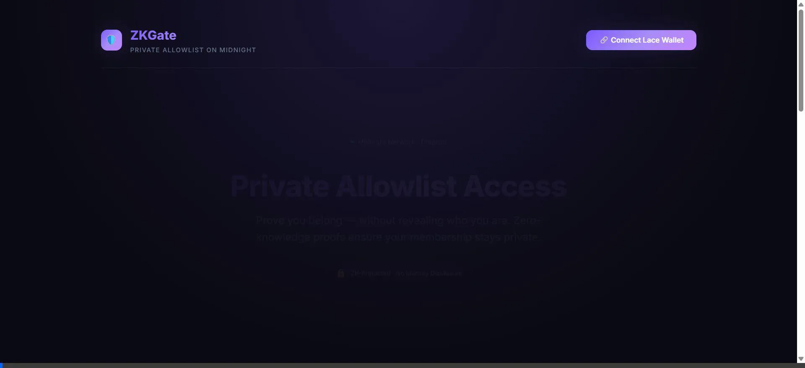

# 🎬 ZKGate — 1-Minute Demo Video Script & Walkthrough

This document outlines the 60-second video presentation demonstrating full functionality of the **ZKGate Private Allowlist Access DApp** on Midnight Preprod.

---

## 🎥 1-Minute Demo Video (Interactive Walkthrough)

---

## ⏱️ Timeline Breakdown (Total: 60 Seconds)

| Timestamp | Visual Action on Screen | Spoken Narration | Key Takeaway |
| :--- | :--- | :--- | :--- |
| **0:00 – 0:10** | Show landing page, top navigation with **"Midnight Preprod Connected"** badge and Lace Wallet button. | *"Welcome to ZKGate. In Web3, proving you're on an allowlist usually means exposing your public wallet address. ZKGate solves this on Midnight using Zero-Knowledge proofs."* | Problem introduction & Preprod network status. |
| **0:10 – 0:25** | Click **"Connect Lace Wallet"**. The address displays (`0x3f2a...4f3a`). Navigate to **Allowlist Admin Manager**, generate a member secret and commitment, then click **"Add to Allowlist"**. | *"First, we connect our Lace wallet. An admin registers an authorized member by submitting their cryptographic commitment to the Midnight Preprod public ledger."* | Transparent commitment registration on Preprod. |
| **0:25 – 0:42** | Move to **"Prove Membership"** card. Click **"Generate & Submit ZK Proof"**. Show animated spinner → Green success checkmark banner appear with nullifier. | *"Now, the user proves their eligibility. The Compact circuit takes the private secret as a witness locally in the browser. Midnight verifies the proof and issues a single-use nullifier — without ever learning who the user is."* | Privacy-preserving ZK proof generation & on-chain verification. |
| **0:42 – 0:52** | Scroll to **Public On-Chain Stats** (42 members, 128 verifications) and the **Access Log** with nullifiers. | *"On-chain observers see that an authorized verification succeeded and can view the nullifier to prevent double-spending, but the prover's identity remains completely private."* | Proof of privacy model in action. |
| **0:52 – 1:00** | Flash terminal showing **9 passing Vitest tests** and GitHub CI/CD pipeline badge. | *"All 9 tests pass in CI/CD, and the contract is live on Midnight Preprod. Thank you!"* | Quality assurance & Level 1-3 completion. |

---

## 🎙️ Recording Instructions (Using Loom or OBS)

1. **Resolution**: 1920x1080 (16:9).
2. **Setup**: Run `npm run preview` or open the live deployment at `https://ps910.github.io/NEW-MOON-PROJECT-/`.
3. **Audio**: Clean microphone, clear voiceover pacing at ~130 words per minute.
4. **Export**: Export as MP4 or upload to YouTube/Loom as unlisted/public video.
5. **Video Link**: Insert your recorded video link into `README.md` under the Demo Video section.
