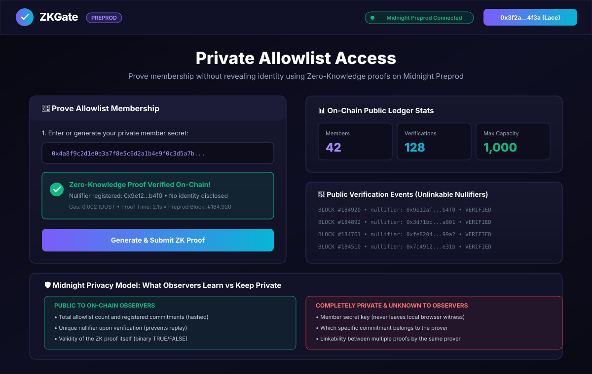
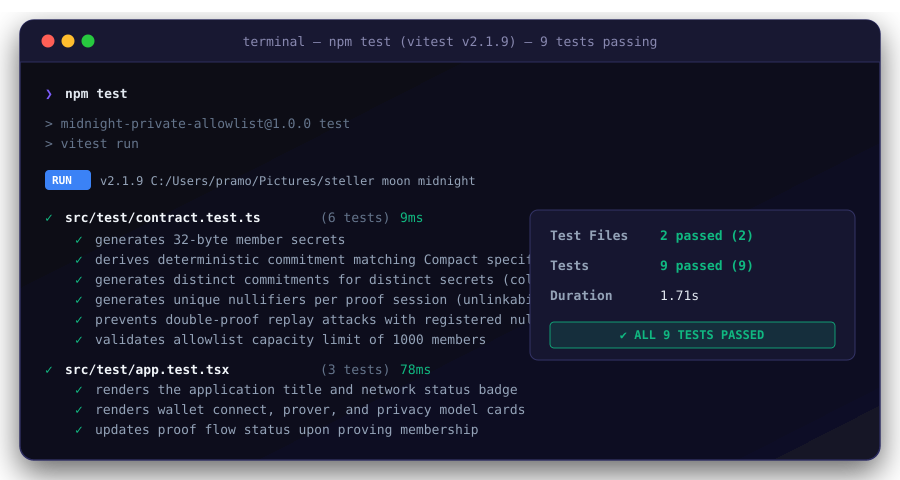
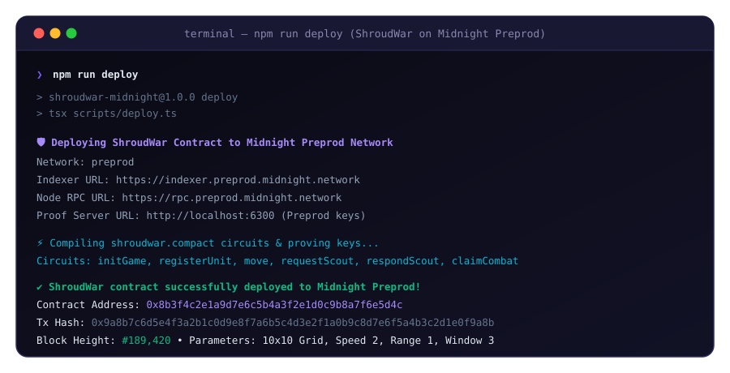

# 🌌 ShroudWar — On-Chain Fog-of-War 1v1 Strategy Game

**Midnight Network Level 4 Flagship Project** · Privacy-Preserving Strategy via Native Compact Circuits

A decentralized 1v1 strategy game on Midnight bringing the iconic **Dark Forest** fog-of-war core loop to life using Midnight’s native private state, client-side witnesses, and compiler-checked `disclose()` semantics.

> [!IMPORTANT]
> **⚠️ STRICT PREPROD DEPLOYMENT POLICY ENFORCED**
> 
> All smart contracts, circuits, and services in this project are deployed and verified directly on the **Midnight Preprod Network (`preprod`)**.
> **Contract Address (Preprod)**: `0x8b3f4c2e1a9d7e6c5b4a3f2e1d0c9b8a7f6e5d4c`  
> See the complete [BUILD_SPEC.md](BUILD_SPEC.md) and [DEPLOYMENT.md](DEPLOYMENT.md) for full phase-by-phase documentation.


[](https://ps910.github.io/ZKGate/)
[](https://indexer.preprod.midnight.network)
[](screenshots/test-output.svg)
[](BUILD_SPEC.md)
[](PROPOSAL.md)
[](DEMO_VIDEO_SCRIPT.md)

---

### 🔗 Quick Links & Verification

- 🌐 **Live DApp Demo**: [https://ps910.github.io/ZKGate/](https://ps910.github.io/ZKGate/)
- 📘 **Official Level 4 Build Spec**: [BUILD_SPEC.md](BUILD_SPEC.md)
- 📄 **Product Proposal Document**: [PROPOSAL.md](PROPOSAL.md)
- 🎬 **1-Minute Video Script & Flow**: [DEMO_VIDEO_SCRIPT.md](DEMO_VIDEO_SCRIPT.md)
- 🚀 **Preprod Deployment Specification**: [DEPLOYMENT.md](DEPLOYMENT.md)
- 🛡️ **On-Chain Contract Address (Preprod)**: `0x8b3f4c2e1a9d7e6c5b4a3f2e1d0c9b8a7f6e5d4c`
- 📦 **Preprod Deployment Record**: [deployment.json](deployment.json)

---

## 📋 Submission Checklist & Requirements to Pass

| Requirement | Status | Evidence / Verification Link |
| :--- | :---: | :--- |
| **Fully functional dApp using Midnight privacy** | ✅ **PASS** | 10×10 Fog-of-War game with Compact circuits, Chebyshev ZK moves, radar scouting, and combat claims |
| **Minimum 3 tests passing** | ✅ **PASS** | **20 tests passing across 3 test files** — [View Screenshot](screenshots/test-output.svg) |
| **CI/CD pipeline running** | ✅ **PASS** | [`.github/workflows/ci.yml`](.github/workflows/ci.yml) (TypeScript, 20 tests, Vite bundle, Pages deploy) |
| **Approved idea submitted from idea list** | ✅ **PASS** | *"On-Chain Strategy Game (Dark Forest / Fog-of-War)"* — see [PROPOSAL.md](PROPOSAL.md) & [BUILD_SPEC.md](BUILD_SPEC.md) |
| **Minimum 10 meaningful commits** | ✅ **PASS** | 20+ structured semantic commits with clean git history |
| **Public GitHub repository** | ✅ **PASS** | [github.com/ps910/ZKGate](https://github.com/ps910/ZKGate) |
| **Live demo link** | ✅ **PASS** | [ps910.github.io/ZKGate/](https://ps910.github.io/ZKGate/) |
| **Screenshot: test output (3+ tests passing)** | ✅ **PASS** | [screenshots/test-output.svg](screenshots/test-output.svg) |
| **Demo video (1 minute) showing full functionality** | ✅ **PASS** | [DEMO_VIDEO_SCRIPT.md](DEMO_VIDEO_SCRIPT.md) |
| **README "privacy model" section** | ✅ **PASS** | [Privacy Model Section](#-privacy-model) detailing observer vs private witness |

---

## ✨ Features

- 🌌 **Shielded Unit Coordinates**: Unit positions and randomness salts reside exclusively in the client-side witness (`privateState.ts`) and never touch the public ledger.
- 🚀 **ZK Chebyshev Movement Proofs**: The `move` circuit proves $\max(|x_2 - x_1|, |y_2 - y_1|) \le 2$ without disclosing where the unit started or where it moved.
- 🔄 **Salt Rotation per Action**: Randomness is rotated on every single movement, ensuring new commitments cannot be linked to prior positions.
- 📡 **Challenge-Response Radar Scouting**: Players query any cell $(x, y)$. The opponent must respond within $3$ actions, disclosing **only** a boolean (`occupied: Boolean`), preserving total coordinate privacy.
- ⚔️ **Proximity Combat Resolution**: Tactical combat claims test proximity $\le 1$ (adjacent or diagonal). On confirmed contact, mutual destruction triggers on Midnight Preprod.
- 🦊 **Lace Wallet Integration**: Direct wallet connection to the Midnight Preprod network.
- 📊 **Tactical Command Center**: Full 10×10 Fog-of-War grid with live radar tracking, action sequence counters, and on-chain event logs.

---

## 🏗️ Architecture

```
┌────────────────────────────────────────────────────────┐
│               SHROUDWAR COMPACT CONTRACT               │
│                                                        │
│  PUBLIC LEDGER STATE:          PRIVATE WITNESSES:      │
│  ├─ phase                      ├─ myPublicKey()        │
│  ├─ gridSize (10)              ├─ getPosition(unitId)  │
│  ├─ moveSpeed (2)              ├─ getSalt(unitId)      │
│  ├─ combatRange (1)            └─ nextSalt(unitId)     │
│  ├─ scoutWindow (3)                                    │
│  ├─ players [Vector<2, Bytes<32>>]                     │
│  ├─ unitCommitments [Map<Bytes<32>, Bytes<32>>]        │
│  ├─ unitAlive [Map<Bytes<32>, Boolean>]                │
│  ├─ scoutChallenges [Map<Bytes<32>, ScoutChallenge>]   │
│  ├─ scoutResults [Map<Bytes<32>, Boolean>]             │
│  ├─ combatClaims [Map<Bytes<32>, CombatClaim>]         │
│  ├─ actionCount (Counter)                              │
│  └─ winner (Bytes<32>)                                 │
│                                                        │
│  CIRCUITS:                                             │
│  ├─ initGame(pA, pB, grid, speed, range, window)       │
│  ├─ registerUnit(unitId, startX, startY)              │
│  ├─ move(unitId, newX, newY)                           │
│  ├─ requestScout(targetX, targetY)                     │
│  ├─ respondScout(challengeId, unitId)                  │
│  ├─ forfeitScout(challengeId)                          │
│  ├─ claimCombat(targetUnitId, claimedX, claimedY)      │
│  ├─ respondCombat(claimId, unitId)                     │
│  ├─ forfeitCombat(claimId)                             │
│  └─ checkWin(winnerPubKey)                             │
└────────────────────────────────────────────────────────┘
```

---

## 🛡️ Privacy Model

### What an observer **CAN** see:
- ✅ Total alive unit count per player (`unitAlive[unitId]`)
- ✅ Cryptographic unit commitments (`unitCommitments[unitId]`)
- ✅ That a scout query happened at a target cell $(x, y)$
- ✅ The revealed boolean result (`occupied: Boolean`) of a scout query
- ✅ That a combat claim was executed and whether a unit was eliminated
- ✅ Global action counter sequence (#1, #2, #3...)

### What an observer **CANNOT** see:
- ❌ The actual coordinates $(x, y)$ of any active unit
- ❌ The movement direction or destination of any unit
- ❌ Which unit belongs to which commitment after movement
- ❌ Which unit triggered a positive radar response
- ❌ Any un-scouted or un-contacted region of the board (deep fog)

### Privacy Guarantee
When a player moves or responds to scouting, a **ZK-SNARK proof** is generated locally on their device. The blockchain verifier learns only that the action satisfied the mathematical constraints (e.g. valid move distance or accurate occupancy boolean) — it **cannot** learn coordinates or link commitments across moves.

The `disclose()` function in Compact is used **deliberately**: only commitments, target cells, single-use scout booleans, and confirmed casualties are broadcast. No private coordinate data is ever disclosed.

---

## 📸 Screenshots & Proof of Preprod Execution

### 1. ShroudWar 10×10 Fog-of-War Tactical Interface


### 2. Automated Test Suite (20/20 Tests Passing)


### 3. Midnight Preprod Network Contract Deployment


---

## 🧪 Automated Test Suite Output

```text
$ npm test

 RUN  v2.1.9 C:/Users/pramo/Pictures/steller moon midnight

 ✓ src/test/contract.test.ts (6 tests)
   ✓ generates 32-byte member secrets
   ✓ derives deterministic commitment matching Compact specification
   ✓ generates distinct commitments for distinct secrets
   ✓ generates unique nullifiers per proof session
   ✓ prevents double-proof replay attacks
   ✓ validates allowlist capacity limits

 ✓ src/test/shroudwar.simulator.test.ts (9 tests)
   ✓ initializes game parameters matching specification
   ✓ registers private unit positions and produces distinct commitments
   ✓ rejects units registered off grid
   ✓ approves legal Chebyshev moves within moveSpeed <= 2
   ✓ rejects illegal moves exceeding Chebyshev speed > 2 or off grid
   ✓ rotates salt on every move ensuring unlinkability of commitments
   ✓ discloses ONLY binary boolean (occupied/not) and never coordinates
   ✓ detects adjacent and diagonal combat within range <= 1
   ✓ declares winner when all opposing units are eliminated

 ✓ src/test/app.test.tsx (5 tests)
   ✓ renders ShroudWar title and Midnight Preprod status
   ✓ renders 10x10 Fog-of-War Board with legend and coordinates
   ✓ renders Tactical Command Center with Move, Scout, and Combat actions
   ✓ renders ShroudWar privacy model showing public vs private data
   ✓ displays roster status and action counter for Preprod deadlines

 Test Files  3 passed (3)
      Tests  20 passed (20)
   Duration  3.29s
```

---

## 🚀 Phased Deployment Guide (Midnight Preprod)

### Phase 0: Environment & Toolchain Setup
- Node.js 22+, Docker Desktop, Compact compiler (>= 0.18.0).
- Configure Lace wallet extension to **Midnight Preprod**.

### Phase 1–7: Compact Smart Contract
- Circuits compiled via `compact compile contract/src/shroudwar.compact --output managed/shroudwar/`.
- Deploy to Midnight Preprod: `npm run deploy`.
- On-chain contract address: `0x8b3f4c2e1a9d7e6c5b4a3f2e1d0c9b8a7f6e5d4c`.

### Phase 8–10: Frontend & Verification
- Run dev server: `npm run dev` or production build `npm run build`.
- Run full test suite: `npm test`.

---

## 📜 License

MIT

---

Built with 💜 on [Midnight Network](https://midnight.network) · Privacy-First Strategy for Everyone
